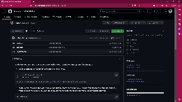
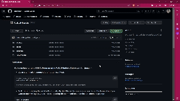
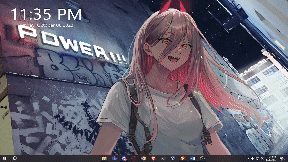

#### Guide on how to run a COBOL Program using DosBox

- Clone this repository to your local machine
```bash
git clone https://github.com/briansuhh/Cobol-Guide.git

# Note: You can also download the repository as a zip file
```

- Move the COBOL folder inside the C drive
```bash
# for windows, you can move the folder by using this command
move <path to your folder> c:

# for linux, you can move the folder by using this command
mv <path to your folder> /mnt/c

# NOTE: you can also move the folder by using the file explorer
```

- Install DosBox if you don't have Dosbox yet
```bash
# for windows, go to this link and download the installer
https://www.dosbox.com/download.php?main=1

# for linux, you can install it using this command
sudo apt install dosbox
```

- Open DosBox and mount the folder where you saved your COBOL program
```bash
# mount the folder by using this command
mount c: c:\COBOL

# go to the drive where you mounted the folder
c:
```

- Go to the COBOL folder and make a hello world program using COBOL, and save it as main.cob or main.cbl
```cobol
       IDENTIFICATION DIVISION.
       PROGRAM-ID. HelloWorld.

       DATA DIVISION.
       WORKING-STORAGE SECTION.
       01  HELLO-MESSAGE PIC X(14) VALUE "Hello, World!".

       PROCEDURE DIVISION.
           DISPLAY HELLO-MESSAGE.                                    
           STOP RUN.
```

- Compile and run the COBOL program
```bash
# compile your program by using this command
realcob main.cob

# after compiling, you can link the object file by using this command
link main.obj

# after linking, you can now run your program by using this command
main.exe    
```

- NOTE: You can only save your COBOL program within the COBOL folder located in the C drive. To save your program in a different folder, mount the desired folder, and transfer all realia files into it.

---
#### Video Guide on how to run a COBOL Program using DosBox
- Step 1: Download the repository as a zip file, extract it to your local machine and move the COBOL folder inside the C drive
<figure class="video_container">
  <video controls="true" allowfullscreen="true" poster="">
    <source src="../assets/STEP1.mp4" type="video/mp4">
  </video>
</figure>

---
- Step 2: Make a hello world program using COBOL, and save it as main.cob or main.cbl
<figure class="video_container">
  <video controls="true" allowfullscreen="true" poster="">
    <source src="../assets/STEP2.mp4" type="video/mp4">
  </video>
</figure>

---
- Step 3: Compile and run the COBOL program using DosBox
<figure class="video_container">
  <video controls="true" allowfullscreen="true" poster="">
    <source src="../assets/STEP3.mp4" type="video/mp4">
  </video>
</figure>

<figure class="video_container">
  <iframe src="https://drive.google.com/file/d/1Ib8A85jWWkp7S8QYnBCh54DUdBLEUhqg/view?usp=drive_link" frameborder="0" allowfullscreen="true"> </iframe>
</figure>

---


---


